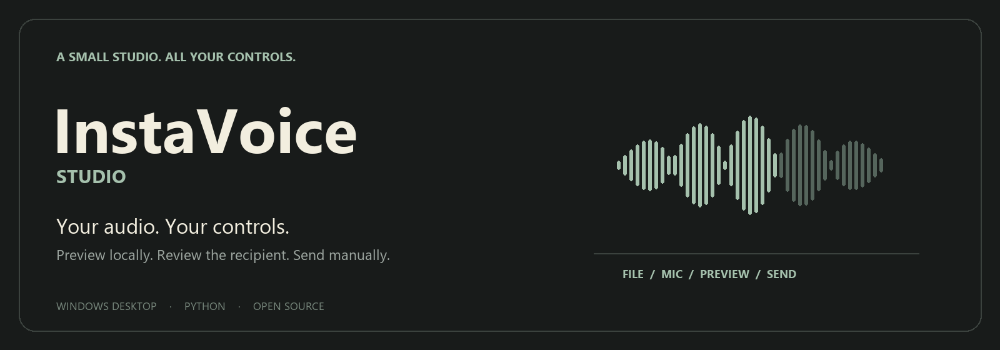

<p align="center"></p>

<p align="center">
  
</p>

<p align="center">
  <a href="LICENSE"></a>
  
  
  
</p>

# InstaVoice Studio

A small Windows desktop studio for preparing audio and manually sending it as an Instagram DM voice note. Pick a file, listen through the right headphones, choose a recipient, and confirm the send yourself.

**No bulk sender. No background messaging. No automatic retries.**

> **Unofficial integration:** Instagram sending uses the third-party `instagrapi` library, not an official Meta API. It may stop working when Instagram changes, and use may conflict with Instagram's terms or trigger account restrictions. Use only your own account and audio you have permission to share. Do not use it for spam, impersonation, or misleading recipients about the source of a recording.

## A studio, not a script

| Control | What it does |
| --- | --- |
| File picker + waveform | Open an existing clip and see its duration |
| Speaker / headphones | Choose where you hear the preview; refresh after reconnecting Bluetooth |
| Play / stop | Listen before sending |
| Volume + speed | Adjust **preview only**; sending uses the original audio |
| Microphone + level meter | Record a new local clip, then review it |
| Optional virtual output | Route preview audio into an installed virtual audio device |
| Saved-session connection | Connect or disconnect without placing credentials in the UI |
| Recipient + confirmation | Review the username and filename before one manual send |
| Status + receipt | See errors and the message ID returned by Instagram |

File sending uploads a converted audio file directly. It **does not** record your microphone or require a virtual audio cable. Virtual routing is a separate optional preview feature.

## Quick start

### Requirements

- **Windows 10/11** with Microsoft Edge WebView2 Runtime
- **Python 3.11** available as `python` or through the Windows Python launcher
- **FFmpeg and ffprobe** available on `PATH`
- A working Instagram session in your own browser, only if you want to send

Clone or download this repository:

```bash
git clone https://github.com/chiragborse1/InstaVoiceStudio.git
cd InstaVoiceStudio
```

For a double-click setup, run **Setup InstaVoice.cmd**, then **Run InstaVoice.cmd**. Or create an isolated environment manually:

```bash
python -m venv .venv
.venv\Scripts\python.exe -m pip install -r requirements.txt
```

Then launch:

```bash
.venv\Scripts\python.exe desktop.py
```

Local playback and recording do not need an Instagram connection. FFmpeg is used for decoding unsupported formats and converting outgoing audio into mono AAC in an M4A container.

### Connect your own session

A session cookie is a **login credential**. Anyone who has it may be able to access your account. Never paste it into a chat, issue, screenshot, or README.

1. Log in normally at `instagram.com` in your browser.
2. In your browser's developer tools, open **Application → Cookies → https://www.instagram.com**.
3. Copy your own `sessionid` value.
4. Run the importer locally:

   ```bash
   .venv\Scripts\python.exe ig_session_import.py
   ```

5. Paste it into the **hidden local prompt**. Clear your clipboard afterward.
6. Open the studio and click **Connect saved session**.

The importer stores authentication data in local `ig_session.json`. Treat that file like a password: it is excluded from Git, but exclusion is **not encryption**. Do not place your checkout in a shared or publicly synced folder. Disconnecting the app does not revoke the browser session; use Instagram's account security settings to revoke sessions when needed.

### Send a clip

1. Choose an audio file, or select a microphone and record a clip.
2. Select your headphones and preview it.
3. Connect the saved session.
4. Enter the exact recipient username.
5. Click **Review send**, check the recipient and file, then **Confirm Send**.

A returned message ID means the API accepted the message, not that the recipient listened to it. If a request times out or its result is uncertain, **check the conversation before sending again**. The app does not retry automatically.

## Troubleshooting

**Headphones missing?** Connect them in Windows first, then click Refresh devices. Device lists reflect what Windows currently exposes.

**Silent mic recording?** Select your physical microphone rather than an unused virtual input. Check Windows microphone privacy settings and the live meter.

**FFmpeg not found?** Install FFmpeg, add its `bin` directory to PATH, and restart the app. `ffmpeg -version` and `ffprobe -version` should work in a new terminal.

**Session expired, challenge, or send failed?** Check Instagram in your normal browser. Resolve account prompts there. Re-import your own current session if necessary. Do not repeatedly retry a restricted account.

**App window fails to start?** Install or repair Microsoft Edge WebView2 Runtime and use Python 3.11 with the dependencies in this repository.

## Development

```bash
python -m unittest discover -v
node --check ui/app.js
python desktop.py --smoke
```

Unit tests use offline client doubles rather than messaging real people. The native smoke test requires Windows, WebView2, and an available output device. Do not substitute real credentials into tests.

The interface uses local Tabler CSS with a pywebview bridge to Python. Audio playback and recording run locally; only explicitly requested Instagram operations use the account connection.

## Scope and limitations

- Windows-first source distribution, not a packaged installer.
- Unofficial Instagram integration; no uptime or account-safety guarantee.
- No bulk messaging, scheduled campaigns, stealth browser login, or account creation.
- Playback speed/volume are not an audio editor and do not alter the outgoing source clip.
- Large clips and device changes can fail; review the status and avoid duplicate sends.

## Contributing

Small fixes and reproducible bug reports are welcome. Include Windows/Python versions and the error category, but **never** attach session files, cookies, personal recordings, or private conversations. See [SECURITY.md](SECURITY.md).

## License & credits

Project code and banner: [MIT](LICENSE), © 2026 Chirag Borse.

The bundled [Tabler](https://github.com/tabler/tabler) stylesheet retains its [MIT notice](ui/vendor/LICENSE-tabler). [pywebview](https://pywebview.flowrl.com/), [python-sounddevice](https://python-sounddevice.readthedocs.io/), [SoundFile](https://python-soundfile.readthedocs.io/), [NumPy](https://numpy.org/), and [instagrapi](https://github.com/subzeroid/instagrapi) are separately installed dependencies under their own licenses. FFmpeg is installed separately and is not redistributed here.

Not affiliated with, endorsed by, or sponsored by Instagram or Meta.
